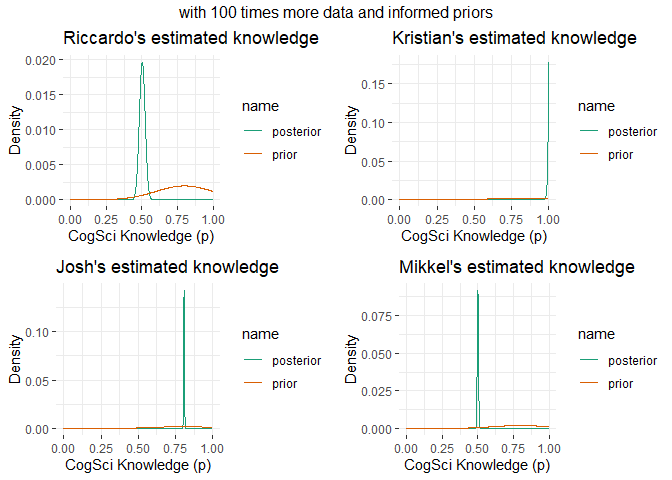
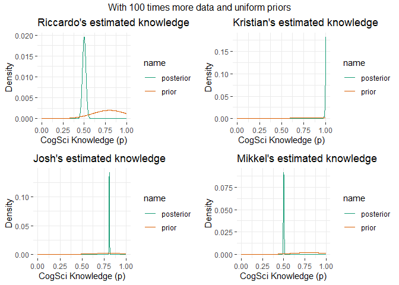
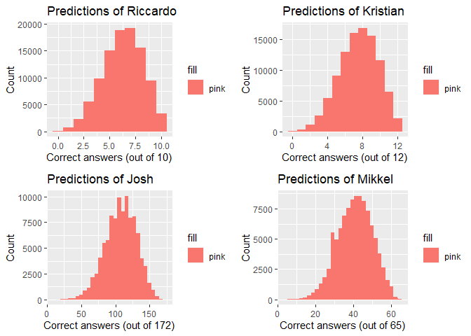
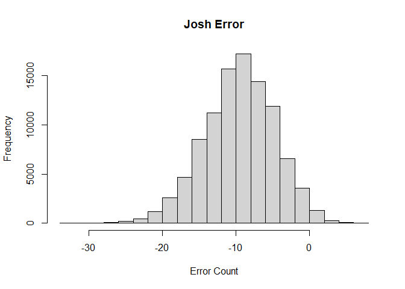

Computational Modeling - Assignment 2
================
Riccardo Fusaroli
29/01/2019

## In this assignment we learn how to assess rates from a binomial distribution, using the case of assessing your teachers’ knowledge of CogSci

N.B. there is a second part at the bottom for next week.

### First part

You want to assess your teachers’ knowledge of cognitive science. “These
guys are a bunch of drama(turgist) queens, mindless philosophers,
chattering communication people and Russian spies. Do they really know
CogSci?”, you think.

To keep things simple (your teachers should not be faced with too
complicated things): - You created a pool of equally challenging
questions on CogSci - Each question can be answered correctly or not (we
don’t allow partially correct answers, to make our life simpler). -
Knowledge of CogSci can be measured on a scale from 0 (negative
knowledge, all answers wrong) through 0.5 (random chance) to 1 (awesome
CogSci superpowers)

This is the data: - Riccardo: 3 correct answers out of 6 questions -
Kristian: 2 correct answers out of 2 questions (then he gets bored) -
Josh: 160 correct answers out of 198 questions (Josh never gets bored) -
Mikkel: 66 correct answers out of 132 questions

Questions:

1.  What’s Riccardo’s estimated knowledge of CogSci? What is the
    probability he knows more than chance (0.5) \[try figuring this out.
    if you can’t peek into chapters 3.1 and 3.2 and/or the slides\]?

<!-- end list -->

  - First implement a grid approximation (hint check paragraph 2.4.1\!)
    with a uniform prior, calculate the posterior and plot the results
  - Then implement a quadratic approximation (hint check paragraph
    2.4.2\!).
  - N.B. for the rest of the exercise just keep using the grid
    approximation (we’ll move to quadratic approximations in two
    classes)

## Question 1 - Ricardo’s knowledge

``` r
# loading packages
library("rstan")
```

    ## Loading required package: StanHeaders

    ## Loading required package: ggplot2

    ## rstan (Version 2.19.3, GitRev: 2e1f913d3ca3)

    ## For execution on a local, multicore CPU with excess RAM we recommend calling
    ## options(mc.cores = parallel::detectCores()).
    ## To avoid recompilation of unchanged Stan programs, we recommend calling
    ## rstan_options(auto_write = TRUE)

    ## For improved execution time, we recommend calling
    ## Sys.setenv(LOCAL_CPPFLAGS = '-march=corei7 -mtune=corei7')
    ## although this causes Stan to throw an error on a few processors.

``` r
pacman::p_load(rethinking, ggplot2, dplyr, tidyverse, tidyr, gridExtra, tidybayes)

#set seed for consistency

set.seed(69)

### Riccardo's estimated knowledge

##grid aproximation##

# define grid
p_grid <- seq(from=0 , to=1 , length.out=1000)

## Priors
uni_prior <- dunif(p_grid, 0,1)
stan_prior <- dnorm(p_grid, mean = 0.8, sd = 0.2)

# compute likelihood at each value in grid
ric_likelihood <- dbinom(3 , size=6 , prob=p_grid )

# compute product of likelihood and prior
uns_ric_posterior <- ric_likelihood * uni_prior
ric_posterior <- uns_ric_posterior/sum(uns_ric_posterior)


# drawing samples
ric_samples <- sample( p_grid , prob=ric_posterior , size=1e4 , replace=TRUE )

#posterior
sum( ric_posterior[ p_grid > 0.5 ] ) # 50 % probability that Ricardo's knowledge above 0.5
```

    ## [1] 0.5

``` r
p_grid[which.max(ric_posterior)]
```

    ## [1] 0.4994995

``` r
## quadratic approximation
ric.qa <- rethinking::map(
  alist(
    w ~ dbinom(6,p) , # binomial likelihood
    p ~ dunif(0,1)), # uniform prior
    data=list(w=3) )

# display summary of quadratic approximation
precis( ric.qa )
```

    ##   mean        sd      5.5%     94.5%
    ## p  0.5 0.2041233 0.1737715 0.8262285

``` r
#curve( dnorm( x , 0.5 , 0.2 ) , lty=2 , add=TRUE )
```

## Question 2

2.  Estimate all the teachers’ knowledge of CogSci. Who’s best? Use grid
    approximation. Comment on the posteriors of Riccardo and Mikkel. 2a.
    Produce plots of the prior, and posterior for each teacher.

<!-- end list -->

``` r
## posterior
calc_teacher_knowledge <- function(n_correct, n_question, prior, length_out = 10000){
  p_grid <- seq(0, 1, length.out= length(prior))
  
  likelihood <- dbinom(n_correct, size = n_question, prob=p_grid)
  
  unstd.posterior <- prior*likelihood
  
  posterior <- unstd.posterior/sum(unstd.posterior)
  
  sampl <- sample(p_grid, prob = posterior, size=1e4 , replace=TRUE)
  
  max_posterior <- p_grid[which.max(posterior)]
  
  HPDI <- HPDI(sampl,prob=0.8) # if bell-shaped, prob doesn't matter
  SD <- sd(sampl)
  
  return(list(teacher_posterior = posterior, 
              likelihood = likelihood,
              max_posterior = max_posterior, 
              teacher_HPDI = HPDI,
              sample = sampl,
              SD=SD))
}

## plotting

pretty_plot <- function(p_grid, prior, posterior, title = " "){
  # define data
  d <- tibble(p_grid = p_grid, 
              prior = prior/length(p_grid),
              posterior = posterior)

  # make to long format
  d <- d %>% 
    pivot_longer(cols = c("prior", "posterior"), names_to = "name", values_to = "value")
  
  # make a 
  p <- ggplot(d, aes(x = p_grid, y = value, color = name)) + 
    geom_line() + 
    labs(x = "CogSci Knowledge (p)", y = "Density", title = title) + 
    theme_bw() + 
    ggplot2::theme(panel.background = element_rect(fill = "White"),
                   panel.border = element_blank()) +
    scale_colour_brewer(palette = "Dark2", direction = 1)
  return(p)
}

#function for giving summary stats
summary_stats <- function(teacher){
  print(teacher$teacher_HPDI)
  print(teacher$max_posterior)
  print(teacher$SD)
}

## Riccardo
ric <- calc_teacher_knowledge(3, 6, uni_prior)
ric_plot <- pretty_plot(p_grid, uni_prior, ric$teacher_posterior, title = "Riccardo's estimated knowledge")
summary_stats(ric)
```

    ##      |0.8      0.8| 
    ## 0.2622623 0.7027027 
    ## [1] 0.4994995
    ## [1] 0.1662436

``` r
## Kristian
kris <- calc_teacher_knowledge (2, 2, uni_prior)
kris_plot <- pretty_plot(p_grid, uni_prior, kris$teacher_posterior, title = "Kristian's estimated knowledge" )
summary_stats(kris)
```

    ##      |0.8      0.8| 
    ## 0.5815816 0.9989990 
    ## [1] 1
    ## [1] 0.195401

``` r
## Josh
josh<- calc_teacher_knowledge(160, 198, uni_prior)
josh_plot <- pretty_plot(p_grid, uni_prior, josh$teacher_posterior, title = "Josh's estimated knowledge" )
summary_stats(josh)
```

    ##      |0.8      0.8| 
    ## 0.7677678 0.8378378 
    ## [1] 0.8078078
    ## [1] 0.02765358

``` r
## Mikkel
mik <- calc_teacher_knowledge(66,132, uni_prior)
mik_plot <- pretty_plot(p_grid, uni_prior, mik$teacher_posterior, title = "Mikkel's estimated knowledge" )
summary_stats(mik)
```

    ##      |0.8      0.8| 
    ## 0.4464464 0.5565566 
    ## [1] 0.4994995
    ## [1] 0.04325721

``` r
## plotting knowledge of everyone at one
grid.arrange(ric_plot, kris_plot, josh_plot, mik_plot, nrow=2)
```

<!-- -->

``` r
sum(kris$sample<josh$sample)/1e4*100 #josh is smarter than Kristian
```

    ## [1] 51.35

## Question 3

3.  Change the prior. Given your teachers have all CogSci jobs, you
    should start with a higher appreciation of their knowledge: the
    prior is a normal distribution with a mean of 0.8 and a standard
    deviation of 0.2. Do the results change (and if so how)? 3a. Produce
    plots of the prior and posterior for each teacher.

<!-- end list -->

``` r
## Riccardo
ric3 <- calc_teacher_knowledge (3, 6, stan_prior)
ric3_plot <- pretty_plot(p_grid, stan_prior, ric3$teacher_posterior, title = "Riccardo's estimated knowledge" )
summary_stats(ric3)
```

    ##      |0.8      0.8| 
    ## 0.4754755 0.7997998 
    ## [1] 0.6466466
    ## [1] 0.1255123

``` r
## Kristian
kris3 <- calc_teacher_knowledge (2, 2, stan_prior)
kris3_plot <- pretty_plot(p_grid, stan_prior, kris3$teacher_posterior, title = "Kristian's estimated knowledge" )
summary_stats(kris3)
```

    ##      |0.8      0.8| 
    ## 0.6886887 1.0000000 
    ## [1] 0.8898899
    ## [1] 0.1337268

``` r
## Josh
josh3 <- calc_teacher_knowledge(160, 198, stan_prior)
josh3_plot <- pretty_plot(p_grid, stan_prior, josh3$teacher_posterior, title = "Josh's estimated knowledge" )
summary_stats(josh3)
```

    ##      |0.8      0.8| 
    ## 0.7697698 0.8388388 
    ## [1] 0.8078078
    ## [1] 0.02727216

``` r
## Mikkel
mik3 <- calc_teacher_knowledge(66,132, stan_prior)
mik3_plot <- pretty_plot(p_grid, stan_prior, mik3$teacher_posterior, title = "Mikkel's estimated knowledge" )
summary_stats(mik3)
```

    ##      |0.8      0.8| 
    ## 0.4534535 0.5625626 
    ## [1] 0.5135135
    ## [1] 0.04261314

``` r
## plotting
grid.arrange(ric3_plot, kris3_plot,josh3_plot, mik3_plot, nrow=2)
```

<!-- -->

## Question 4

4.  You go back to your teachers and collect more data (multiply the
    previous numbers by 100). Calculate their knowledge with both a
    uniform prior and a normal prior with a mean of 0.8 and a standard
    deviation of 0.2. Do you still see a difference between the results?
    Why?

<!-- end list -->

``` r
## Ricardo
ric4_uni <- calc_teacher_knowledge (300, 600, uni_prior)
ric4_stan <- calc_teacher_knowledge(300, 600, stan_prior)


## Kristian
kris4_uni <- calc_teacher_knowledge (200, 200, uni_prior)
kris4_stan <- calc_teacher_knowledge(200, 200, stan_prior)


## Josh
josh4_uni <- calc_teacher_knowledge (16000, 19800, uni_prior)
josh4_stan <- calc_teacher_knowledge(16000, 19800, stan_prior)


## Mikkel
mik4_uni <- calc_teacher_knowledge (6600, 13200, uni_prior)
mik4_stan <- calc_teacher_knowledge(6600, 13200, stan_prior)

#summary stats with uniform priors
summary_stats(ric4_uni)
```

    ##      |0.8      0.8| 
    ## 0.4724725 0.5245245 
    ## [1] 0.4994995
    ## [1] 0.02040559

``` r
summary_stats(kris4_uni)
```

    ##     |0.8     0.8| 
    ## 0.992993 1.000000 
    ## [1] 1
    ## [1] 0.004899818

``` r
summary_stats(josh4_uni)
```

    ##      |0.8      0.8| 
    ## 0.8058058 0.8128128 
    ## [1] 0.8078078
    ## [1] 0.00282995

``` r
summary_stats(mik4_uni)
```

    ##      |0.8      0.8| 
    ## 0.4934935 0.5045045 
    ## [1] 0.4994995
    ## [1] 0.004398021

``` r
#summary stats with an informed prior
summary_stats(ric4_stan)
```

    ##      |0.8      0.8| 
    ## 0.4774775 0.5285285 
    ## [1] 0.5035035
    ## [1] 0.02005631

``` r
summary_stats(kris4_stan)
```

    ##     |0.8     0.8| 
    ## 0.991992 1.000000 
    ## [1] 1
    ## [1] 0.00506084

``` r
summary_stats(josh4_stan)
```

    ##      |0.8      0.8| 
    ## 0.8058058 0.8128128 
    ## [1] 0.8078078
    ## [1] 0.002808291

``` r
summary_stats(mik4_stan)
```

    ##      |0.8      0.8| 
    ## 0.4934935 0.5045045 
    ## [1] 0.5005005
    ## [1] 0.004433293

``` r
## Riccardo
ric4_stan_plot <-
  pretty_plot(p_grid, stan_prior, ric4_stan$teacher_posterior, title = "Riccardo's estimated knowledge")


## Kristian

kris4_stan_plot <-
  pretty_plot(p_grid, stan_prior, kris4_stan$teacher_posterior, title = "Kristian's estimated knowledge")

## Josh

josh4_stan_plot <-
  pretty_plot(p_grid, stan_prior, josh4_stan$teacher_posterior, title = "Josh's estimated knowledge")

## Mikkel

mik4_stan_plot <-
  pretty_plot(p_grid, stan_prior, mik4_stan$teacher_posterior, title = "Mikkel's estimated knowledge")

## plotting
grid.arrange(ric4_stan_plot, kris4_stan_plot,josh4_stan_plot, mik4_stan_plot, nrow=2, top = "with 100 times more data and informed priors")
```

<!-- -->

``` r
#Riccardo
ric4_uni_plot <-
  pretty_plot(p_grid, stan_prior, ric4_uni$teacher_posterior, title = "Riccardo's estimated knowledge")


## Kristian

kris4_uni_plot <-
  pretty_plot(p_grid, stan_prior, kris4_uni$teacher_posterior, title = "Kristian's estimated knowledge")

## Josh

josh4_uni_plot <-
  pretty_plot(p_grid, stan_prior, josh4_uni$teacher_posterior, title = "Josh's estimated knowledge")

## Mikkel

mik4_uni_plot <-
  pretty_plot(p_grid, stan_prior, mik4_uni$teacher_posterior, title = "Mikkel's estimated knowledge")

## plotting
## plotting
grid.arrange(ric4_uni_plot, kris4_uni_plot,josh4_uni_plot, mik4_uni_plot, nrow = 2, top = "With 100 times more data and uniform priors") 
```

<!-- -->

## Question 5

5.  Imagine you’re a skeptic and think your teachers do not know
    anything about CogSci, given the content of their classes. How would
    you operationalize that belief?

### Second part: Focusing on predictions

Questions to be answered (but see guidance below): 1- Write a paragraph
discussing how assessment of prediction performance is different in
Bayesian vs. frequentist models 2- Provide at least one plot and one
written line discussing prediction errors for each of the teachers.

This is the old data: - Riccardo: 3 correct answers out of 6 questions -
Kristian: 2 correct answers out of 2 questions (then he gets bored) -
Josh: 160 correct answers out of 198 questions (Josh never gets bored) -
Mikkel: 66 correct answers out of 132 questions

This is the new data: - Riccardo: 9 correct answers out of 10 questions
(then he freaks out about teaching preparation and leaves) - Kristian: 8
correct answers out of 12 questions - Josh: 148 correct answers out of
172 questions (again, Josh never gets bored) - Mikkel: 34 correct
answers out of 65 questions

``` r
## calculating new knowledge
ric_new <- calc_teacher_knowledge(9, 10, ric3$teacher_posterior)
kris_new <- calc_teacher_knowledge(8, 12, kris3$teacher_posterior)
josh_new <- calc_teacher_knowledge(148, 172, josh3$teacher_posterior)
mik_new <- calc_teacher_knowledge(34, 65, mik3$teacher_posterior)


## function for a plot of posterior comparison
comp_distrib_plot <- function(old_posterior, new_posterior, title = ""){
  # define data
  d <- tibble(old_posterior = old_posterior,
              new_posterior = new_posterior,
              p_grid = p_grid)
  d <- d %>% 
      pivot_longer(cols = c("old_posterior", "new_posterior"), names_to = "name", values_to = "value")
  
  # make a 
  p <- ggplot(d, aes(x = p_grid, y = value, colour = name)) + 
    geom_line()+ 
    labs(y = "Density", x = " Posterior of teacher's knowledge", title = title)
  p
  
  return(p)
}

## running the plot comparison function on data of all 4 teachers
ric_comp <- comp_distrib_plot(ric3$teacher_posterior, ric_new$teacher_posterior, title = "Riccardo's estimated knowledge 2019 & 2020")
kris_comp <- comp_distrib_plot(kris3$teacher_posterior, kris_new$teacher_posterior, title = "Kristian's estimated knowledge 2019 & 2020")
josh_comp <- comp_distrib_plot(josh3$teacher_posterior, josh_new$teacher_posterior, title = "Josh's estimated knowledge 2019 & 2020")
mik_comp <- comp_distrib_plot(mik3$teacher_posterior, mik_new$teacher_posterior, title = "Mikkel's estimated knowledge 2019 & 2020")

all_comparison <- grid.arrange(ric_comp, kris_comp, josh_comp, mik_comp, nrow=2)
```

<!-- -->

``` r
### histogram function

hist_function <- function(posterior, n_questions, bin_width, x = "", title = ""){
  
  #drawing samples
  sampling <- sample(size = 100000,
                     x = p_grid,
                     prob = posterior,
                     replace = T)
  pos_pred <- rbinom(100000,
                     size = n_questions,
                     prob = sampling)
  #doing some nice plots
  d <- as.data.frame(pos_pred)
 
   g <- ggplot(d, aes(pos_pred, fill = "pink"))+ 
     geom_histogram() + 
     labs(x = x, y = "Count", title = title) +
     stat_bin(binwidth = bin_width)
   return(g)
}

ric_his <- hist_function(ric3$teacher_posterior, 10, 1, x = "Correct answers (out of 10)", title = "Predictions of Riccardo")
kris_his <- hist_function(ric3$teacher_posterior, 12, 1, x = "Correct answers (out of 12)", title = "Predictions of Kristian")
josh_his <- hist_function(ric3$teacher_posterior, 172, 1, x = "Correct answers (out of 172)", title = "Predictions of Josh")
mik_his <- hist_function(ric3$teacher_posterior, 65, 1, x = "Correct answers (out of 65)", title = "Predictions of Mikkel")

grid.arrange(ric_his, kris_his, josh_his, mik_his, nrow=2)
```

    ## `stat_bin()` using `bins = 30`. Pick better value with `binwidth`.
    ## `stat_bin()` using `bins = 30`. Pick better value with `binwidth`.
    ## `stat_bin()` using `bins = 30`. Pick better value with `binwidth`.
    ## `stat_bin()` using `bins = 30`. Pick better value with `binwidth`.

<!-- -->

``` r
# this function makes a histogram of errors
error_hist <- function(posterior, questions, correct, name){
  samples <-  sample(p_grid , prob=posterior , size=100000 , replace=TRUE )
  error_hist <- hist(samples * questions - correct,  main=name, breaks=questions, xlab = "Error Count")
  return(error_hist)
}

# this function makes a histogram of errors (used for large samples to control bin width)
error_hist2 <- function(posterior, questions, correct, name){
  samples <-  sample(p_grid , prob=posterior , size=100000 , replace=TRUE)
  error_hist <- hist(samples * questions - correct,  main=name, xlab = "Error Count")
  return(error_hist)
}
error_hist(ric3$teacher_posterior,10,9, "Riccardo Error")
```

<!-- -->

    ## $breaks
    ##  [1] -8 -7 -6 -5 -4 -3 -2 -1  0  1
    ## 
    ## $counts
    ## [1]    45   612  3477 11537 24080 30228 22136  7331   554
    ## 
    ## $density
    ## [1] 0.00045 0.00612 0.03477 0.11537 0.24080 0.30228 0.22136 0.07331 0.00554
    ## 
    ## $mids
    ## [1] -7.5 -6.5 -5.5 -4.5 -3.5 -2.5 -1.5 -0.5  0.5
    ## 
    ## $xname
    ## [1] "samples * questions - correct"
    ## 
    ## $equidist
    ## [1] TRUE
    ## 
    ## attr(,"class")
    ## [1] "histogram"

``` r
error_hist(kris3$teacher_posterior,12,8, "Kristian Error")
```

<!-- -->

    ## $breaks
    ##  [1] -7 -6 -5 -4 -3 -2 -1  0  1  2  3  4
    ## 
    ## $counts
    ##  [1]     4    22   136   539  1651  4308  9316 15605 21156 24172 23091
    ## 
    ## $density
    ##  [1] 0.00004 0.00022 0.00136 0.00539 0.01651 0.04308 0.09316 0.15605 0.21156
    ## [10] 0.24172 0.23091
    ## 
    ## $mids
    ##  [1] -6.5 -5.5 -4.5 -3.5 -2.5 -1.5 -0.5  0.5  1.5  2.5  3.5
    ## 
    ## $xname
    ## [1] "samples * questions - correct"
    ## 
    ## $equidist
    ## [1] TRUE
    ## 
    ## attr(,"class")
    ## [1] "histogram"

``` r
error_hist2(josh3$teacher_posterior,172,148, "Josh Error")
```

<!-- -->

    ## $breaks
    ##  [1] -34 -32 -30 -28 -26 -24 -22 -20 -18 -16 -14 -12 -10  -8  -6  -4  -2   0   2
    ## [20]   4   6   8
    ## 
    ## $counts
    ##  [1]     1     3    12    54   209   463  1178  2609  4670  8527 11257 15695
    ## [13] 17200 14414 11916  6570  3566  1304   294    56     2
    ## 
    ## $density
    ##  [1] 0.000005 0.000015 0.000060 0.000270 0.001045 0.002315 0.005890 0.013045
    ##  [9] 0.023350 0.042635 0.056285 0.078475 0.086000 0.072070 0.059580 0.032850
    ## [17] 0.017830 0.006520 0.001470 0.000280 0.000010
    ## 
    ## $mids
    ##  [1] -33 -31 -29 -27 -25 -23 -21 -19 -17 -15 -13 -11  -9  -7  -5  -3  -1   1   3
    ## [20]   5   7
    ## 
    ## $xname
    ## [1] "samples * questions - correct"
    ## 
    ## $equidist
    ## [1] TRUE
    ## 
    ## attr(,"class")
    ## [1] "histogram"

``` r
error_hist2(mik$teacher_posterior,65,34, "Mikkel Error")
```

<!-- -->

    ## $breaks
    ##  [1] -13 -12 -11 -10  -9  -8  -7  -6  -5  -4  -3  -2  -1   0   1   2   3   4   5
    ## [20]   6   7   8   9  10
    ## 
    ## $counts
    ##  [1]     6    16    76   246   609  1454  3022  5054  8395 10874 13052 14459
    ## [13] 13011 10839  8206  5184  3052  1438   606   286    92    19     4
    ## 
    ## $density
    ##  [1] 0.00006 0.00016 0.00076 0.00246 0.00609 0.01454 0.03022 0.05054 0.08395
    ## [10] 0.10874 0.13052 0.14459 0.13011 0.10839 0.08206 0.05184 0.03052 0.01438
    ## [19] 0.00606 0.00286 0.00092 0.00019 0.00004
    ## 
    ## $mids
    ##  [1] -12.5 -11.5 -10.5  -9.5  -8.5  -7.5  -6.5  -5.5  -4.5  -3.5  -2.5  -1.5
    ## [13]  -0.5   0.5   1.5   2.5   3.5   4.5   5.5   6.5   7.5   8.5   9.5
    ## 
    ## $xname
    ## [1] "samples * questions - correct"
    ## 
    ## $equidist
    ## [1] TRUE
    ## 
    ## attr(,"class")
    ## [1] "histogram"
